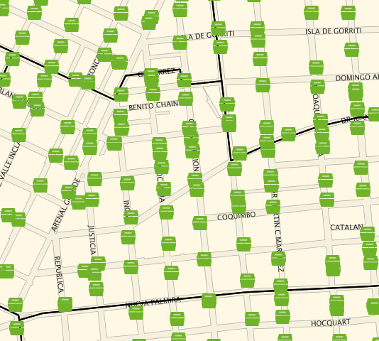
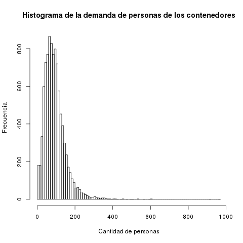
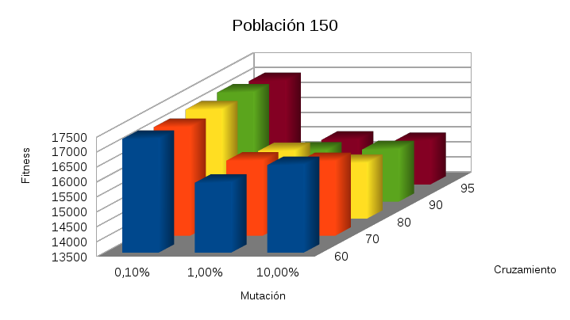
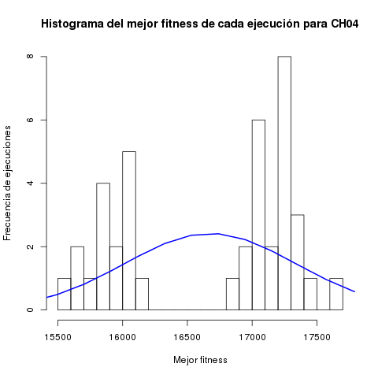
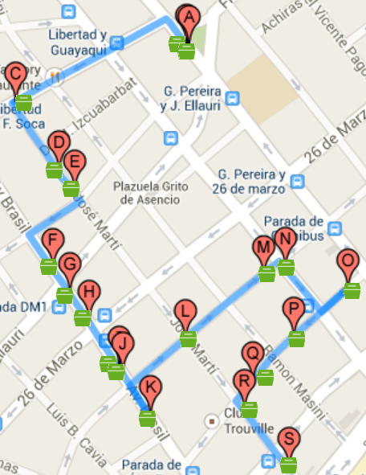

# TRSH project

This project is about minimizing costs in garbage collection in Montevideo (city and state), Uruguay, using Evolving Algorithms techniques. This was presented as a project in 2014 in the course [Algoritmos Evolutivos](http://www.fing.edu.uy/inco/cursos/evolutivos) (Evolving Algorithms) of the [Facultad de Ingeniería](http://www.fing.edu.uy) (Faculty of Engineering), [Universidad de la República](http://www.udelar.edu.uy) (University of the Republic). Is based in real and open data (as of 2014), but also makes some assumptions. Read this file for information. For more information take a look at [the final report](Informe.pdf) or see the [initial proposal](Propuesta.pdf), which are both in Spanish. The authors are [Santiago Castro](https://github.com/bryant1410) and Matías Mansilla, and the supervisor is Sergio Nesmachnow.

The code is written in C++ and uses [Malva framework](https://themalvaproject.github.io/).

## The project in images

Example of distribution of containers in La Comercial neighborhood, Montevideo:



Histogram of how long it takes to fill the containers:



Performance of the algorithm varying some parameters:



Fitness of the algorithm in different runs in CH04 zone:



Route of the solution for Thursdays for CH04 zone:



## MPICH installation in Fedora

### With root access

```bash
yum install mpich mpich-devel
```

### In user space

Download from [MPICH](https://www.mpich.org/) the RPM mpich and mpich-devel files. Then convert to cpio format and extract them. Merge them in the same folder. Then link to this folder from Malva. In order to find the MPICH headers when compiling, use environment variables and/or pass arguments (changing the Makefile).

## Centroids of each block

1. Get the coordinates of each city block using [MMQGIS](http://michaelminn.com/linux/mmqgis/) plugin.
2. Calculate the centroid of each one.
3. Convert them from EPSG:32721 - WGS 84 / UTM zone 21S (WGS 84 / UTM zone 21S (SRID=32721)) to WGS 84 (SRID=4326).

## Useful resources

Useful resources, ordered by the phase of the project:

* [Map of Municipalities of Montevideo](http://municipios.montevideo.gub.uy/)
* [Map of Community Centers by Municipality](http://www.montevideo.gub.uy/institucional/centros-comunales)
* [Map of Montevideo's garbage containers](http://www.montevideo.gub.uy/contenedores-de-residuos-domiciliarios-y-sus-horarios-de-recoleccion)
* [File with containers and its positions in Montevideo](http://geoweb.montevideo.gub.uy/geoserver/imm/wms?service=WMS&version=1.1.0&request=GetMap&layers=imm:V_DF_CONTENEDORES_GEOM&styles=&bbox=559075.338431189,6134593.96516533,588125.66640065,6150393.65167756&width=606&height=330&srs=EPSG:32721&format=application%2Fatom%2Bxml)
* [Map of recyclable materials containers of Montevideo](http://www.montevideo.gub.uy/contenedores-para-clasificacion-de-residuos-secos-domiciliarios) (not used in this work)
* [Cleaning circuits of Montevideo](http://www.montevideo.gub.uy/file/5630/download)
* [CEMPRE, Uruguay - FAQ](http://www.cempre.org.uy/index.php?option=com_wrapper&view=wrapper&Itemid=86)
* [CEPIS/OPS-HDT 17: Simple method of analysis of solid waste](http://www.bvsde.paho.org/eswww/proyecto/repidisc/publica/hdt/hdt017.html)
* [Population and information of Montevideo by block](https://catalogodatos.gub.uy/dataset/poblacion-por-zona-censal-en-montevideo/resource/2b08ef46-c669-407a-b0f3-81d948d3fea3)
* [Density of population of Montevideo state by neighborhood](http://www.ine.gub.uy/mapas/mapas%20tematicos/densidad%20pobl%20xbarrios.pdf)
* [MMQGIS](http://michaelminn.com/linux/mmqgis/)
* [Get list of coordinates for points in a layer?](https://gis.stackexchange.com/questions/8844/get-list-of-coordinates-for-points-in-a-layer/8911#8911)
* [Polygon Centroid Point Calculator](http://easycalculation.com/area/polygon-centroid-point.php)
* [Coordinates transformation on-line](http://cs2cs.mygeodata.eu/)
* [Google Maps Directions API](https://developers.google.com/maps/documentation/directions/)
* [Scrapy | A Fast and Powerful Scraping and Web Crawling Framework](http://scrapy.org/)
* [MPICH](https://www.mpich.org/)
* [Malva framework](https://themalvaproject.github.io/)
* [Google Maps JavaScript API v3 example: directions waypoints](http://www.geocodezip.com/v3_directions_multipleWayPts_CustomMrkrsB.html)
* [How can I trigger a notification when a job/process ends?](https://superuser.com/questions/345447/how-can-i-trigger-a-notification-when-a-job-process-ends)
* [Linux - Find out CPU architecture information](http://www.cyberciti.biz/faq/lscpu-command-find-out-cpu-architecture-information/)
* [R: Histograms](https://stat.ethz.ch/R-manual/R-devel/library/graphics/html/hist.html)
* [Lilliefors test for normality](http://in-silico.net/tools/statistics/lillieforstest)
* [Mann-Whitney test](http://www.uv.es/ceaces/scrips/tablas/M-W0.htm)
